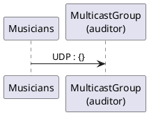
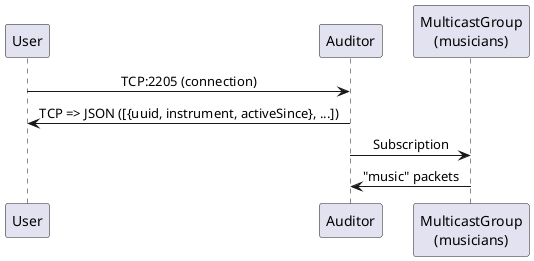

UDP Orchestra
=============

Célestin Piccin & Kévin Jorand

------------

## Introduction

Dans ce nouveau laboratoire, nous implémentons un "Orchestre UDP", composé de serveurs "musiciens" et d'un serveur "auditeur". Les premiers "jouent" de la musique en envoyant périodiquement des trames UDP (dont le payload varie selon "l'instrument" du "musicien") à un groupe multicast. Le second écoute ce même groupe multicast et garde trace des différents "musiciens" actifs (récemment). Ce dernier implémente aussi un serveur TCP qui permettra, à la connection de recevoir les informations "actuelles" (donc les musiciens actifs avec leur instrument).

## Tasks and questions

Reminder: answer the following questions [here](https://forms.gle/6SM7cu4cYhNsRvqX8).

### Diagrams
**Musicians**


**Auditor**


### Task 1: design the application architecture and protocols


#### How can we represent the system in an **architecture diagram**, which gives information both about the Docker containers, the communication protocols and the commands? 

#### Who is going to **send UDP datagrams** and **when**? 
Les musiciens envoient les trames UDP toutes les secondes sur le groupe multicast / le port défini par le protocole.

#### Who is going to **listen for UDP datagrams** and what should happen when a datagram is received?
L'auditeur (/les auditeurs) écoute le groupe multicast à l'adresse spécifiée par le protocole. A chaque trame reçue, l'auditeur détermine le type d'instrument ayant émis "son" et l'ajoute à la liste des musiciens actifs. S'il s'agit du premier son reçu, il note le timestand comme "activeSince". De plus un musicien qui n'a pas été actif depuis 5 secondes est retiré de la liste en question. Pour ce faire on tient encore à jour un attribut lastPlay dans notre liste qui permettra de connaitre le timestamp du dernier son reçu ... donc quand le retirer de la liste des musiciens actifs.

#### What **payload** should we put in the UDP datagrams?
Le payload des trames UDP contient : 
```js
{
	idMusician,
	sound
}
```
Au format JSON, autrement dit quelque chose du type :
```json
{
	"idMusician":"e02 . . . 33b8",
	"sound":"ti-ta-ti"
}
```

#### What **data structures** do we need in the UDP sender and receiver? When will we update these data structures? When will we query these data structures?

### Task 2: implement a "musician" Node.js application

#### In a JavaScript program, if we have an object, how can we **serialize it in JSON**?
Il suffit d'employer la fonction ad-hoc : 
```js
JSON.stringify(OBJECT);
```

#### What is **npm**?
NPM est littéralement le `Nope Package Manager`. Il s'agit d'un gestionnaire de paquets pour les projets JavaScript qui fonctionnent avec Node.js. Il permet  de télécharger, installer et gérer facilement leurs dépendances. 

#### What is the `npm install` command?
La commande `npm install` permet de télécharger et d'installer les paquets spécifiés dans le fichier `package.json`. Elle installe également les éventuelles dépendances de ces paquets. En exécutant cette commande sans spécifier de paquet, elle installera tous les paquets listés dans le fichier `package.json`.

#### How can we use the `https://www.npmjs.com/` web site?
Le site web [https://www.npmjs.com/](https://www.npmjs.com/) est un référentiel en ligne pour les paquets npm. Il permet de rechercher des paquets, de consulter leur documentation et de les télécharger. On peut également y publier nos propres paquets pour que d'autres personnes puissent les utiliser.

Sur le site, il est possible de naviguer à travers les différentes catégories, de rechercher des paquets spécifiques (par exemple via la barre de recherche) et de consulter les informations sur les paquets tels que les versions, les dépendances et la documentation.

#### In JavaScript, how can we **generate a UUID** compliant with RFC4122?
En javascript, plus précisément avec Node.js, on peut générer un tel UUID grace à la fonction `v4()` du paquet `uuid`. Puisque c'est la seule que nous utilisons, nous avons fait un alias pour pouvoir l'utiliser comme `uuid()`.

#### In Node.js, how can we execute a function on a **periodic** basis?
La manière la plus simple est la fonction
```js
setInterval(function, intervalInMs);
```
qui n'est d'ailleurs pas spécifique à Node.js. 

#### In Node.js, how can we **emit UDP datagrams**?
Le package `dgram` étant déprécié, nous avons choisi d'utiliser la librairie du module : `module:dgram`. Ensuite, le code est relativement simple (en supposant que l'on souhaite utiliser IPv4) :
```js
const socket = dgram.createSocket('udp4')

socket.send(payload, PORT, ADDRESS, function(err, bytes){
	if(err){
		console.log(err);
	}else{
		console.log("Sending payload: " + payload + " via port " + socket.address().port);
	}
});
```

#### In Node.js, how can we **access the command line arguments**?
Nous pouvons utiliser :
```js
const { argv } = require('process')
```
Puis nous pouvons utiliser `argv` comme n'importe quel tableau:
```js
const instrument = argv[2];
```

### Task 3: package the "musician" app in a Docker image

#### How do we **define and build our own Docker image**?                                
En créant un Dockerfile et en mettant les instructions nécessaires pour notre image personnalisée dedans.
Ensuite pour build l'image on utilise la commande `docker build`, par exemple : ```docker build -t dai/musician .``` ou dai/musician sera le nom de limage et ```.``` l'endroit ou trouver le Dockerfile donc ici ```.``` => répertoire courant.

#### How can we use the `ENTRYPOINT` statement in our Dockerfile?                        
```ENTRYPOINT``` est utilisé de manière équivalente à CMD => permet de fournir des paramètres au container lorsque celui ci se lance. La différence entre les deux étant que les paramètres de CMD peuvent être override ce qui n'est pas le cas avec ```ENTRYPOINT``` ou les paramètres fournis seront appendus.

Par exemple dans notre Dockerfile de musician : ```ENTRYPOINT ["node", "/opt/app/index.js"]``` et si par le suite on lance un container : ```docker run -d dai/musician drum``` alors le résultat final qui sera exécuté dans le container sera bien ```node /opt/app/index.js drum```. Avec ```CMD```, ```drum``` overriderait le reste et du coup cela ne fonctionnerait pas.

#### After building our Docker image, how do we use it to **run containers**?            
Avec la commande suivante (en partant du principe que l'image se nomme dai/musician) : ```docker run -d dai/musician drum```. Ici un container contenant un musician de type ```drum``` sera lancé. A noter que le ```-d``` n'est pas obligatoire, il permet seulement de lancé le container en background.

#### How do we get the list of all **running containers**?
Avec ```docker container ls``` ou alors avec ```docker ps```.

#### How do we **stop** and **kill** one running container?
On stop un container avec ```docker stop my_container```.
On tue un container avec ```docker kill my_container```.

#### How can we check that our running containers are effectively sending UDP datagrams? 
Il y a plusieurs façons de faire, par exemple on peut logger à chaque fois qu'un datagramme UDP est envoyé. 

On peut aussi utiliser tcpdump, par exemple depuis un container en execution (dans notre cas on a choisi le port 8059 pour le multicast) : ```tcpdump -i eth0 udp and port 8059```. Avec cet commande on peut bien voir en live les datagrammes UDP qui transitent.

### Task 4: implement an "auditor" Node.js application

#### With Node.js, how can we listen for UDP datagrams in a multicast group?
D’abord on crée un socket UDP : ```const socket = dgram.createSocket('udp4')```.

Ensuite on bind le socket a un port (dans notre cas nous avons choisi le port 8059) et on s'ajoute dans le groupe multicast (pour nous 231.6.7.9) : 
```
socket.bind(protocol.PROTOCOL_PORT, () => {
    console.log("Joining multicast group");
    socket.addMembership(protocol.PROTOCOL_MULTICAST_ADDRESS);
});
```

#### How can we use the `Map` built-in object introduced in ECMAScript 6 to implement a **dictionary**?
Un objet ```Map``` contient des paires de clé-valeur et se comporte tel une hashmap classique. On peut donc crée facilement un dictionnaire en utilisant les différentes méthodes fournies par ```Map``` notamment ```has()```, ```set()```, ```delete()``` et ```get()```.

#### How can we use the `Day.js` npm module to help us with **date manipulations** and formatting?
Le module Day.js est très utile pour tout ce qui concerne date et temps. 

On peut notamment appelé le constructeur pour récupérer un timestamp du temps actuel, par exemple: ```const day = require('dayjs')``` puis lorsqu'on veut un timestamp ```const activeSince = day();```.


On peut aussi utiliser la méthode ```diff()``` qui renvoie la différence entre deux dates en ms, très utile dans notre cas pour vérifier si un musicien n'a plus joué de son durant les dernières 5 secondes `day().diff(musician.lastPlay) > 5000`. 

#### When and how do we **get rid of inactive players**?                                                

```
if(day().diff(musician.lastPlay) > protocol.INTERVAL){
            musicians.delete(key);
        }
```  
On utilise justement Day.js pour voir s'il n'a plus joué de son instrument durant les dernières 5 secondes (protocal.INTERVAL vaut 5000 (5000ms = 5sec)).

Si c'est le cas on se débarasse de lui en le supprimant du dictionnaire des musiciens actifs. 
Dans notre cas, la fonction qui regarde si des musiciens sont inactif s'effectue toutes les demis secondes (```setInterval(checkActive, 500);```) du coup dans le pire des cas un musicien inactif peut rester dans la ```Map``` des musiciens actifs durant 5.5s. 

Si on veut plus de précision il faudrait réduire le délai entre les check ou alors utiliser des timers.

#### How do I implement a **simple TCP server** in Node.js?

En utilisant le module net: ```const net = require('net')```. 

On commence par crée un serveur TCP avec ```const server = net.createServer(onClientConnection);``` où ```onClientConnection``` est notre fonction de callback qui renvoie les musiciens actifs au client. 

Puis on écoute sur un port dans l'attente de clients, pour ce labo c'est le port 2205. 
```
server.listen(protocol.TCP_PORT, () => {
    console.log('Server started on port '+ protocol.TCP_PORT)
});
```

### Task 5: package the "auditor" app in a Docker image

#### How do we validate that the whole system works, once we have built our Docker image? 
En utilisant les scripts fournis pour valider le laboratoire ^^


## Conclusion
