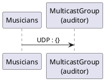
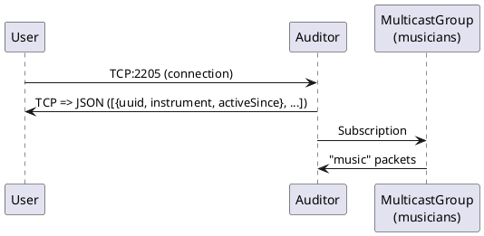

UDP Orchestra
=============

Célestin Piccin & Kévin Jorand

------------

## Introduction

Dans ce nouveau laboratoire, nous implémentons un "Orchestre UDP", composé de serveurs "musiciens" et d'un serveur "auditeur". Les premiers "jouent" de la musique en envoyant périodiquement des trames UDP (dont le payload varie selon "l'instrument" du "musicien") à un groupe multicast. Le second écoute ce même groupe multicast et garde trace des différents "musiciens" actifs (récemment). Ce dernier implémente aussi un serveur TCP qui permettra, à la connection de recevoir les informations "actuelles" (donc les musiciens actifs avec leur instrument).

## Tasks and questions

Reminder: answer the following questions [here](https://forms.gle/6SM7cu4cYhNsRvqX8).

### Diagrams
**Musicians**

**Auditor**

### Task 1: design the application architecture and protocols

| #        | Topic                                                                                                                                                                   |
| -------- | ----------------------------------------------------------------------------------------------------------------------------------------------------------------------- |
| Question | How can we represent the system in an **architecture diagram**, which gives information both about the Docker containers, the communication protocols and the commands? |
|          | _Insert your diagram here..._                                                                                                                                           |
| Question | Who is going to **send UDP datagrams** and **when**?                                                                                                                    |
|          | _Enter your response here..._                                                                                                                                           |
| Question | Who is going to **listen for UDP datagrams** and what should happen when a datagram is received?                                                                        |
|          | _Enter your response here..._                                                                                                                                           |
| Question | What **payload** should we put in the UDP datagrams?                                                                                                                    |
|          | _Enter your response here..._                                                                                                                                           |
| Question | What **data structures** do we need in the UDP sender and receiver? When will we update these data structures? When will we query these data structures?                |
|          | _Enter your response here..._                                                                                                                                           |

### Task 2: implement a "musician" Node.js application

| #        | Topic                                                                               |
| -------- | ----------------------------------------------------------------------------------- |
| Question | In a JavaScript program, if we have an object, how can we **serialize it in JSON**? |
|          | _Enter your response here..._                                                       |
| Question | What is **npm**?                                                                    |
|          | _Enter your response here..._                                                       |
| Question | What is the `npm install` command?                                                  |
|          | _Enter your response here..._                                                       |
| Question | How can we use the `https://www.npmjs.com/` web site?                               |
|          | _Enter your response here..._                                                       |
| Question | In JavaScript, how can we **generate a UUID** compliant with RFC4122?               |
|          | _Enter your response here..._                                                       |
| Question | In Node.js, how can we execute a function on a **periodic** basis?                  |
|          | _Enter your response here..._                                                       |
| Question | In Node.js, how can we **emit UDP datagrams**?                                      |
|          | _Enter your response here..._                                                       |
| Question | In Node.js, how can we **access the command line arguments**?                       |
|          | _Enter your response here..._                                                       |

### Task 3: package the "musician" app in a Docker image

| #        | Topic                                                                               |
| -------- | ----------------------------------------------------------------------------------- |
| Question | How do we **define and build our own Docker image**?                                |
|          | _Enter your response here..._                                                       |
| Question | How can we use the `ENTRYPOINT` statement in our Dockerfile?                        |
|          | _Enter your response here..._                                                       |
| Question | After building our Docker image, how do we use it to **run containers**?            |
|          | _Enter your response here..._                                                       |
| Question | How do we get the list of all **running containers**?                               |
|          | _Enter your response here..._                                                       |
| Question | How do we **stop** and **kill** one running container?                              |
|          | _Enter your response here..._                                                       |
| Question | How can we check that our running containers are effectively sending UDP datagrams? |
|          | _Enter your response here..._                                                       |

### Task 4: implement an "auditor" Node.js application

| #        | Topic                                                                                              |
| -------- | -------------------------------------------------------------------------------------------------- |
| Question | With Node.js, how can we listen for UDP datagrams in a multicast group?                            |
|          | _Enter your response here..._                                                                      |
| Question | How can we use the `Map` built-in object introduced in ECMAScript 6 to implement a **dictionary**? |
|          | _Enter your response here..._                                                                      |
| Question | How can we use the `Day.js` npm module to help us with **date manipulations** and formatting?      |
|          | _Enter your response here..._                                                                      |
| Question | When and how do we **get rid of inactive players**?                                                |
|          | _Enter your response here..._                                                                      |
| Question | How do I implement a **simple TCP server** in Node.js?                                             |
|          | _Enter your response here..._                                                                      |

### Task 5: package the "auditor" app in a Docker image

| #        | Topic                                                                                |
| -------- | ------------------------------------------------------------------------------------ |
| Question | How do we validate that the whole system works, once we have built our Docker image? |
|          | _Enter your response here..._                                                        |

## Conclusion
